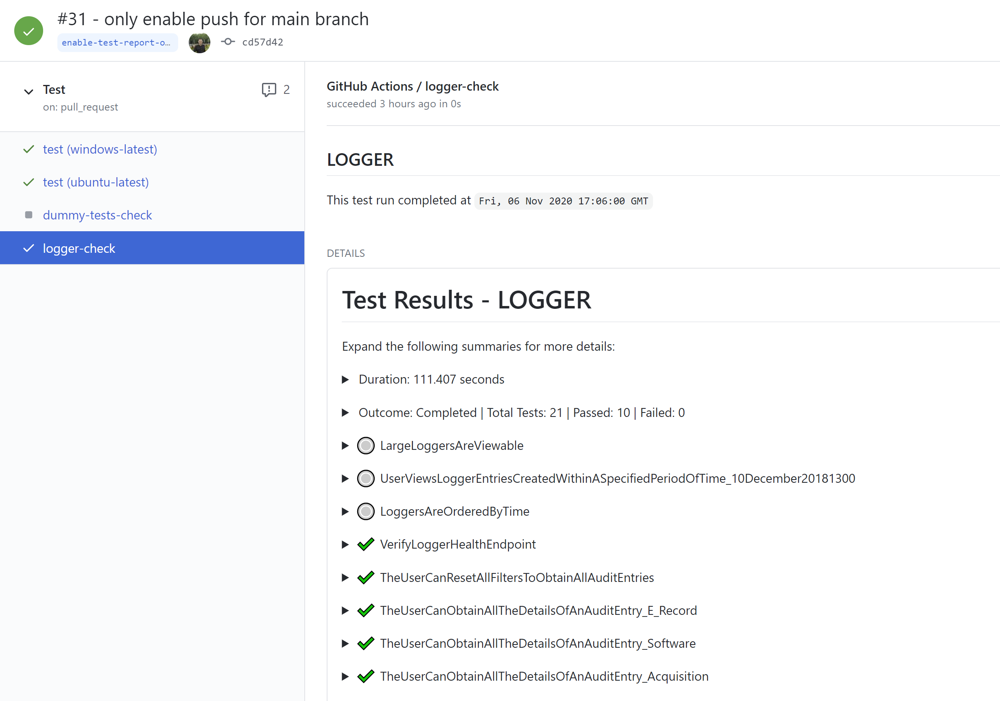
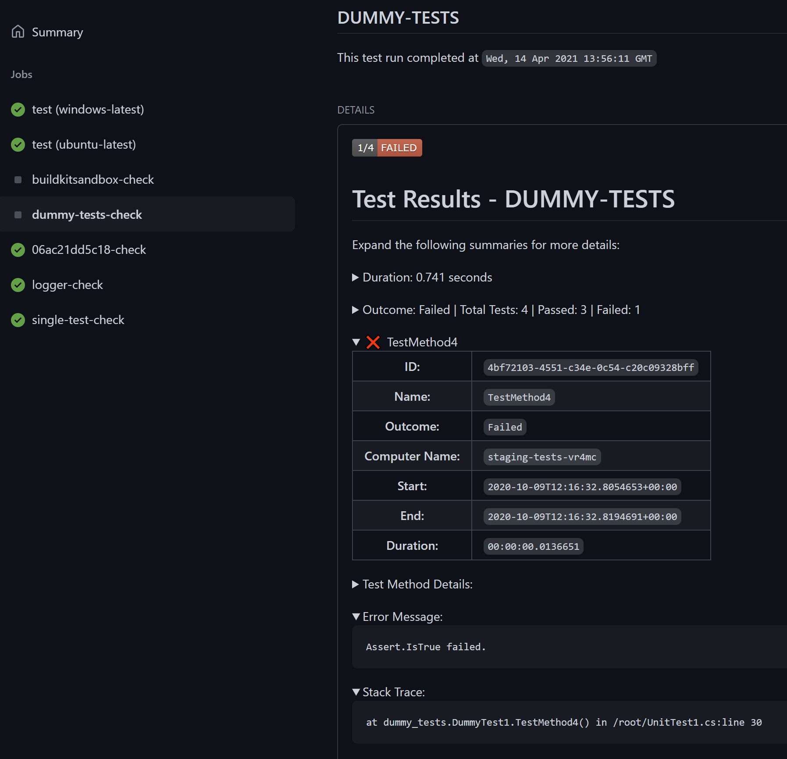

# trx-parser 🧹

> This Action was inspired by https://github.com/zyborg/dotnet-tests-report

[](https://github.com/NasAmin/trx-parser/actions?workflow=Build)
[](https://github.com/NasAmin/trx-parser/actions?workflow=Test)
[](https://github.com/NasAmin/trx-parser/releases/latest)
---

This GitHub Action provides a way of parsing dotnet test results from trx files in a given directory. The action will find trx files specified in the `TRX-PATH` input variable. This path must be accessible to the action.

It will read each individual .trx file. Loads up its data and converts it to a typed json object to make it easier to traverse through the data.
For each TRX, it will create a Github Status check and generate a markup report for each trx. The report name and title are derived from the trx file using the `data.TestRun.TestDefinitions.UnitTest[0]._storage`

## Reports
The following reports show a failing and a passing check generated by this action.

**Workflow Reports:**
<table border="2">
  <tr><td></td>
  <td></td> </tr>
</table>

## Usage

To make `trx-parser` a part of your workflow, just add the following to your existing workflow file in your `.github/workflows/` directory in your GitHub repository.

```yml
name: Test
on: [pull_request]

jobs:
  Build:
    runs-on: ubuntu-latest
    steps:
      # Replace this whichever way you build your code
      - name: Build & Test dotnet code
        run: |
          dotnet restore
          dotnet build -c Release no-restore
          dotnet test -c Release --no-restore --no-build --loger trx --results-directory ./TestResults
      # Using the trx-parser action
      - name: Parse Trx files
        uses: NasAmin/trx-parser@v0.1
        id: trx-parser
        with:
          TRX_PATH: ${{ github.workspace }}/TestResults #This should be the path to your TRX files
          REPO_TOKEN: ${{ secrets.GITHUB_TOKEN }}          
```

### ⚠️ GitHub Actions Limitations ⚠️
- The GitHub Checks API has a [limit](https://github.com/github/docs/issues/3765) of `65535` characters. So if the test report exceeds this limit, GitHub will fail to create a check and fail your workflow.
This was mitigated on #103 and #138 to only report details about failing tests. 
- If you have multiple workflows triggered by the same event, currently GitHub Actions will randomly associate a check run to one of the workflows. This is because currently there is no Check Suite API. [Only GitHub apps](https://docs.github.com/en/rest/reference/checks#check-suites) are allowed to create a Check Suite. There is also no way to associate a custom check run with an existing check suite.
GitHub actions automatically creates a check suite for each workflow run. However, since check runs are associated with a commit and event, any custom check runs are randomly linked under one of the triggered workflows for the same commit.

## Contributing
Anyone is welcome to contribute and make this action better. Please fork the repository and create a pull request with proposed changes.

### Development
* Clone this repository
* Run `npm run build` and `npm run test`
* Run `npm run all` to regenerate the dist directory.
