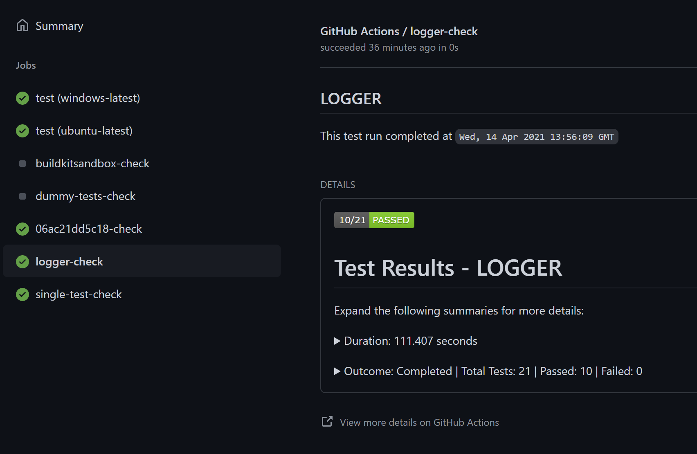

# trx-parser 🧹

> This Action was inspired by https://github.com/zyborg/dotnet-tests-report

[](https://github.com/NasAmin/trx-parser/actions?workflow=Build)
[](https://github.com/NasAmin/trx-parser/actions?workflow=Test)
[](https://github.com/NasAmin/trx-parser/releases/latest)
---

This GitHub Action provides a fast and reliable way of parsing dotnet test results from trx files in a given directory. The action will find trx files specified in the `TRX-PATH` input variable. This path must be accessible to the action.

The action features **parallel processing** for improved performance - it will read and process multiple .trx files concurrently, convert them to typed JSON objects, and create GitHub Status checks in parallel. Each TRX file generates a detailed markup report with the report name and title derived from `data.TestRun.TestDefinitions.UnitTest[0]._storage`.

## Reports
The following reports show a failing and a passing check generated by this action.

**Workflow Reports:**
<table border="2">
  <tr><td></td>
  <td></td> </tr>
</table>

## Usage

To make `trx-parser` a part of your workflow, just add the following to your existing workflow file in your `.github/workflows/` directory in your GitHub repository.

```yml
name: Test
on: [pull_request]

jobs:
  Build:
    runs-on: ubuntu-latest
    steps:
      # Replace this whichever way you build your code
      - name: Build & Test dotnet code
        run: |
          dotnet restore
          dotnet build -c Release no-restore
          dotnet test -c Release --no-restore --no-build --logger trx --results-directory ./TestResults
      # Using the trx-parser action
      - name: Parse Trx files
        uses: NasAmin/trx-parser@v0.1
        id: trx-parser
        with:
          TRX_PATH: ${{ github.workspace }}/TestResults #This should be the path to your TRX files
          REPO_TOKEN: ${{ secrets.GITHUB_TOKEN }}          
```

## Inputs
| Name | Description | Default | Required |
| ---- | ----------- | ------- | -------- |
| `TRX_PATH` | Path to the directory container your test files | `./TestResults` | `yes` |
| `REPO_TOKEN` | GitHub token to create status checks  | `nil` | `yes` |
| `SHA` | The commit SHA associated with the checks. This is optional | `nil` | `no` |
| `IGNORE_FAILURE` | If true, will not set status check as failure. | `false` | `no` |
| `REPORT_PREFIX` | The prefix for the report name. Useful for matrix builds | `nil` | `no` |


### ⚠️ GitHub Actions Limitations ⚠️
- The GitHub Checks API has a [limit](https://github.com/github/docs/issues/3765) of `65535` characters. So if the test report exceeds this limit, GitHub will fail to create a check and fail your workflow.
This was mitigated on #103 and #138 to only report details about failing tests. 
- If you have multiple workflows triggered by the same event, currently GitHub Actions will randomly associate a check run to one of the workflows. This is because currently there is no Check Suite API. [Only GitHub apps](https://docs.github.com/en/rest/reference/checks#check-suites) are allowed to create a Check Suite. There is also no way to associate a custom check run with an existing check suite.
GitHub actions automatically creates a check suite for each workflow run. However, since check runs are associated with a commit and event, any custom check runs are randomly linked under one of the triggered workflows for the same commit.

## Architecture

This action features a modern, modular architecture designed for maintainability and performance:

### 🏗️ Modular Code Structure
The codebase is organized into focused, single-responsibility modules:

- **`src/config/constants.ts`** - Configuration and constants
- **`src/parsers/trx-parser.ts`** - TRX file parsing logic  
- **`src/services/github-service.ts`** - GitHub API operations
- **`src/services/report-service.ts`** - Report generation
- **`src/utils/file-utils.ts`** - File operations
- **`src/utils/test-analyzer.ts`** - Test result analysis
- **`src/validators/input-validator.ts`** - Input validation

### ⚡ Performance Features
- **Parallel TRX Processing**: TRX files are processed concurrently for faster execution
- **Parallel Check Creation**: GitHub check runs are created in parallel for better throughput
- **Optimized Async Patterns**: Enhanced async/await usage throughout the codebase

### 🔧 Modern Dependencies
- **TypeScript 5.8.3** with strict mode for enhanced type safety
- **Latest stable dependencies** with zero security vulnerabilities
- **Modern GitHub Actions workflows** with improved caching and error handling

## Contributing
Anyone is welcome to contribute and make this action better. Please fork the repository and create a pull request with proposed changes.

### Development
* Clone this repository
* Install dependencies: `npm install`
* Build the project: `npm run build`
* Run tests: `npm run test`
* Lint code: `npm run lint` (or `npm run lint-fix` to auto-fix)
* Format code: `npm run format`
* Package for distribution: `npm run package`
* Run all checks: `npm run all`

The modular architecture makes it easy to:
- Add new TRX parsing features in `src/parsers/`
- Extend GitHub integrations in `src/services/`
- Add new validation rules in `src/validators/`
- Enhance utility functions in `src/utils/`
